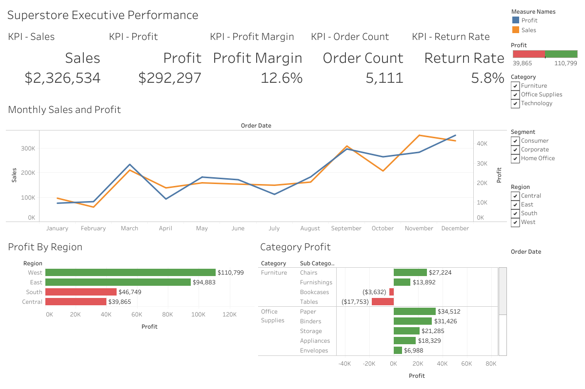

# Superstore financial analytics

This portfolio project uses MySQL to model and analyze 10,194 Superstore order lines, then uses CSV extracts to publish the results in Tableau Public. Tableau Public cannot connect directly to a local MySQL database, so the project separates the analytical database from the presentation layer.

## Interactive dashboard

[Explore the interactive dashboards on Tableau Public](https://public.tableau.com/views/SuperstoreFinancialAnalytics/ExecutivePerformance?:language=en-US&:display_count=n&:origin=viz_share_link)

## Dashboard preview

[](https://public.tableau.com/views/SuperstoreFinancialAnalytics/ExecutivePerformance?:language=en-US&:display_count=n&:origin=viz_share_link)

## Project workflow

```text
Superstore Excel workbook
          ↓
Clean staging CSV files
          ↓
MySQL star schema and SQL analysis
          ↓
Analysis-ready CSV extracts, including forecast
          ↓
Tableau Public dashboards
```

MySQL remains the primary analysis layer. The Tableau CSV files mirror the three reporting views and provide a practical way to publish the dashboards without exposing or hosting a database.

## Skills demonstrated

- MySQL 8: staging tables, star-schema modeling, primary and foreign keys, indexes, joins, CTEs, window functions, conditional aggregation, views, and reconciliation checks
- Financial analysis: growth, profit margin, budget variance, discount leakage, return exposure, and a 12-month seasonal forecast
- Tableau Public: calculated fields, extracts, filters, dashboard actions, and executive presentation
- Communication: documented assumptions, limitations, findings, and recommendations

## Repository structure

```text
data/       Clean staging files loaded into MySQL
sql/        Database schema, loading, validation, analysis, views, and extract queries
tableau/    Analysis-ready files used by Tableau Public
images/     Dashboard previews for GitHub
docs/       Data dictionary and dashboard instructions
tools/      Reproducible Excel-to-CSV preparation script
```

## Part 1 — Build the MySQL analysis

Run these scripts in MySQL Workbench in numerical order:

1. `sql/00_create_database.sql`
2. `sql/01_schema.sql`
3. `sql/02_load_and_transform.sql`
4. `sql/03_data_quality_checks.sql`
5. `sql/04_profitability_analysis.sql`
6. `sql/05_budget_variance.sql`
7. `sql/06_return_and_customer_risk.sql`
8. `sql/07_forecast.sql`
9. `sql/08_tableau_views.sql`
10. Optionally run `sql/09_tableau_extract_queries.sql` to export the reporting views from Workbench.

Script `07` also creates `vw_tableau_forecast`, which combines historical monthly actuals with the next 12 months of forecast results.

The row-count and sales-difference checks in script `03` should return zero differences. Scripts `07` and `08` create the three reporting views represented by the Tableau extracts.

### Loading note

Before running `02_load_and_transform.sql`, replace `C:/path/to/` in all four `LOAD DATA LOCAL INFILE` statements with the absolute location of the repository. Use forward slashes. For example:

```sql
LOAD DATA LOCAL INFILE
'C:/Users/your-name/Documents/superstore-financial-analytics/data/orders.csv'
```

Do not commit your personal path, username, or database credentials to GitHub. MySQL Server and the Workbench connection must both permit `LOAD DATA LOCAL INFILE`.

Script `00` creates the database only when it does not already exist. Script `01` creates missing tables without deleting existing objects. Script `02` intentionally clears and reloads only this project's staging, dimension, and fact tables, making the data load repeatable without dropping the entire database.

If `LOAD DATA LOCAL INFILE` is unavailable, use Workbench's Table Data Import Wizard for the four files in `data/`. Import them into their corresponding staging or budget tables, then run script `02` beginning with `START TRANSACTION`; do not run its opening `TRUNCATE` or `LOAD DATA` statements after using the wizard.

## Part 2 — Create the Tableau Public data sources

Three ready-to-use extracts are included:

- `tableau/tableau_order_lines.csv`: one row per product line, including returns and regional managers
- `tableau/tableau_budget_variance.csv`: one row per month, region, and category for actual-versus-budget reporting
- `tableau/tableau_forecast.csv`: monthly historical actuals and a 12-month forecast by region and category

In Tableau Public:

1. Select **Text File** and open `tableau/tableau_order_lines.csv`.
2. Rename the data source **Order line analysis**.
3. Build the executive performance and margin-risk dashboards.
4. Select **Data → New Data Source → Text File**.
5. Open `tableau/tableau_budget_variance.csv`.
6. Rename it **Budget variance** and build the variance dashboard.
7. Add another text-file data source using `tableau/tableau_forecast.csv`.
8. Rename it **Forecast** and build the forecast section described in `docs/tableau_dashboard_guide.md`.

Keep all three as separate data sources. They have different grains, and joining them would repeat monthly budget or forecast values across order lines.

Use the supplied CSV for the initial build rather than a CSV exported from the Workbench result grid. Several product names contain commas; a Workbench export without text quoting creates generic Tableau fields such as `F25` and hides the expected final columns.

## Refreshing the Tableau extracts from MySQL

The included extracts are ready for initial dashboard development. To demonstrate the complete SQL workflow after loading MySQL:

1. Run `sql/09_tableau_extract_queries.sql` one query at a time.
2. In the Workbench result grid, select **Export recordset to an external file**.
3. Export the results as `tableau_order_lines.csv`, `tableau_budget_variance.csv`, and `tableau_forecast.csv`.
4. In Tableau Public, replace or refresh the corresponding text-file data sources.

This keeps the public visualization portable while showing that the published datasets were produced through SQL views.

To rebuild all three Tableau extracts from the validated staging files without reopening the legacy Excel workbook, run `python tools/build_tableau_extracts.py`.

## Forecast method

The base forecast projects the 2026 monthly Region × Category pattern into 2027. Forecast sales equal the corresponding prior-year monthly sales plus 6%. Forecast profit uses the projected sales and the prior-year profit margin plus 0.5 percentage points. The extract retains 2023–2026 actuals so Tableau can show the historical trend before the 2027 forecast.

This is a transparent planning baseline rather than a statistical forecast. The growth and margin assumptions are labeled in every forecast row.

## Planning assumption

The source workbook contains actual transactions but no budget. The budget is a portfolio-only scenario based on prior-year monthly actuals by region and category. It assumes 8% sales growth and a 1 percentage-point improvement in profit margin. It must not be presented as source data or a company forecast.

## Main finding

2026 sales exceeded the simulated budget by approximately $82,519, while profit exceeded it by only $17. Central and South missed their profit targets, Furniture produced a 1.53% margin, and discount levels above 30% generated substantial losses.

## Portfolio description

> Built a MySQL financial analytics model from 10,194 retail order lines, created reconciliation controls and reusable reporting views, analyzed profitability and budget variance with CTEs and window functions, created a 12-month seasonal forecast, and exported analysis-ready datasets for Tableau Public dashboards.

## Limitations

This is a synthetic portfolio analysis. The source provides sales and profit but not a full income statement, operating-expense detail, inventory costing, cash flow, tax, refund amounts, or return dates. Returned sales are described as exposure rather than confirmed lost revenue.
